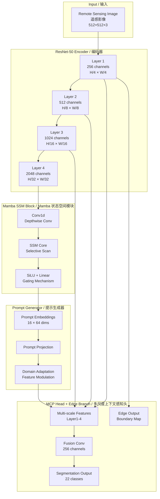
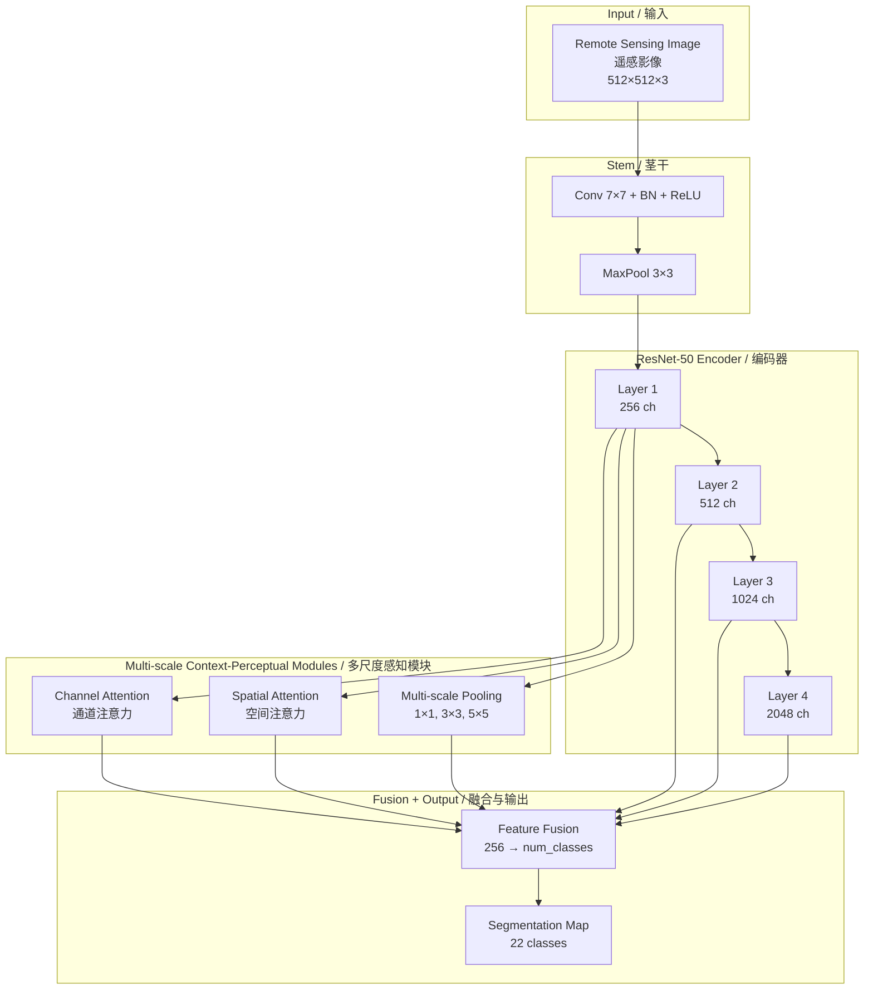
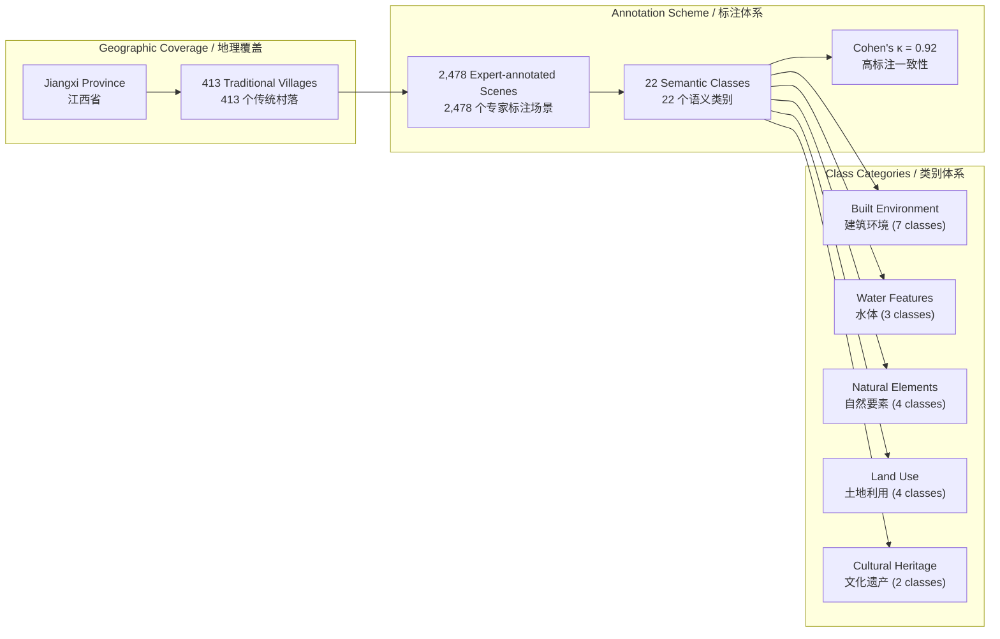
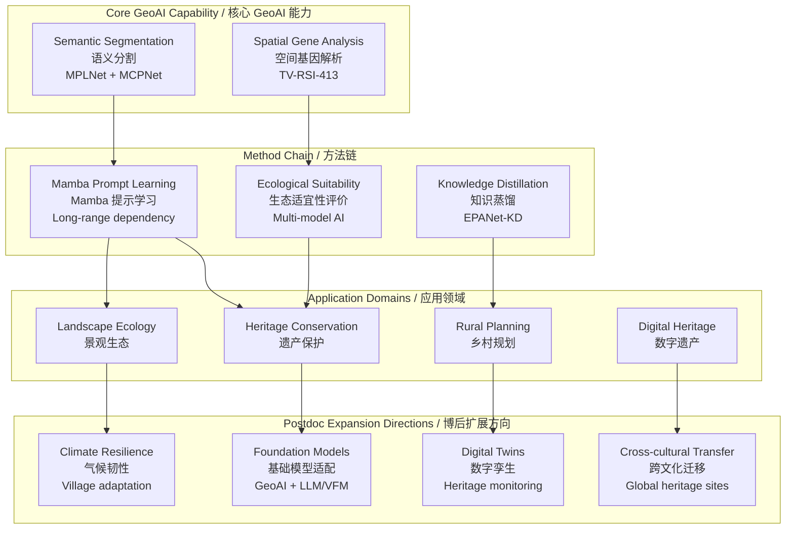
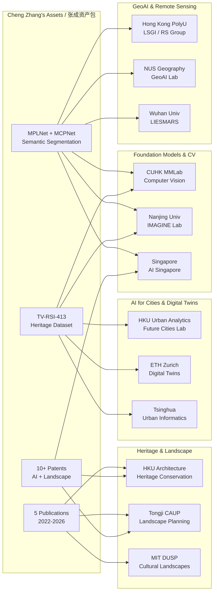

# Figures & Tables for Cultural Heritage GeoAI Portfolio
# 文化遗产 GeoAI 博士后资产包 — 图表说明

> **Cheng Zhang, PhD / 张成博士**
>
> This directory contains visual assets extracted and reconstructed from published papers (Zhang et al., 2022–2026) for academic portfolio demonstration.

---

## Figure 1: MPLNet Architecture Overview / MPLNet 架构总览

## Figure 2: MCPNet Architecture Overview / MCPNet 架构总览

## Figure 3: TV-RSI-413 Dataset Overview / TV-RSI-413 数据集总览

## Figure 4: Research Scope Expansion / 研究范畴扩展图谱

## Figure 5: Competitive Advantage Matrix / 竞争优势矩阵

| Dimension / 维度 | Typical CV Approach / 普通简历 | This Portfolio / 本资产包 | Advantage / 优势 |
|---|---|---|---|
| **Papers / 论文** | Lists paper titles | Shows paper sequence forming a research system (Macro→Meso→Micro→Cross-scale) | Demonstrates research continuity |
| **Code / 代码** | Links to scattered repos | Complete model zoo with training pipeline, configs, and evaluation scripts | Ready for reproduction |
| **Data / 数据** | Mentions dataset name | Full dataset card with annotation protocol, class definitions, and quality metrics | Verifiable data pipeline |
| **Patents / 专利** | Lists patent numbers | Links patents to specific model components and methods | Method-system translation |
| **Domain / 领域** | States "Landscape Architecture" | Shows AI capability grounded in 2022 heritage conservation foundation paper | AI + Domain legitimacy |
| **Collaboration / 合作** | "I hope to learn..." | Structured research package ready for joint projects and grants | PI-ready collaboration proposal |

## Figure 6: Postdoc Position Matching Map / 博士后岗位匹配图谱

## Figure 7: Publication Timeline with Method Evolution / 论文时间线与方法演进

| Year | Publication | Method | Research Scale | Capability Built | Application |
|------|-------------|--------|----------------|------------------|-------------|
| 2022 | Yanfang Ancient Village | Ecological wisdom analysis | Village / Case | Heritage conservation domain | Conservation planning |
| 2024 | EPANet-KD | Knowledge distillation | Provincial / Classification | Efficient model deployment | Village typology |
| 2025 | Ecological suitability | AI multi-model integration | Provincial / Suitability | Environmental spatial analysis | Site selection |
| 2026 | MPLNet (Mamba prompt learning) | Mamba SSM + Prompt | Village / Segmentation | Long-range dependency modeling | Remote sensing |
| 2026 | **TV-RSI-413 + MCPNet** | MCP architecture | Cross-scale / Framework | Spatial gene framework | Heritage GeoAI |

---

*Note on PDF Figures:* The original papers (Zhang et al., 2022–2026) contain additional publication-quality figures including semantic segmentation result comparisons, confusion matrices, class distribution statistics, and geographical distribution maps. These should be extracted from the published PDFs and added to the `images/` folder for portfolio display. The Mermaid diagrams above are reconstructions based on code-verified architecture, config-verified class definitions, and author-provided research descriptions.

*关于论文原图：* 原始论文（Zhang et al., 2022-2026）包含了出版级别的图表，包括语义分割结果对比、混淆矩阵、类别分布统计和地理分布图。这些图应从已发表 PDF 中提取后添加到 `images/` 文件夹用于资产包展示。以上 Mermaid 图表是基于代码验证的架构、配置文件验证的类别定义和作者提供的研究描述重建的。