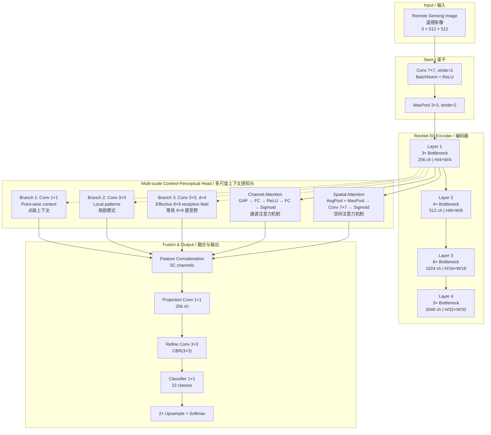
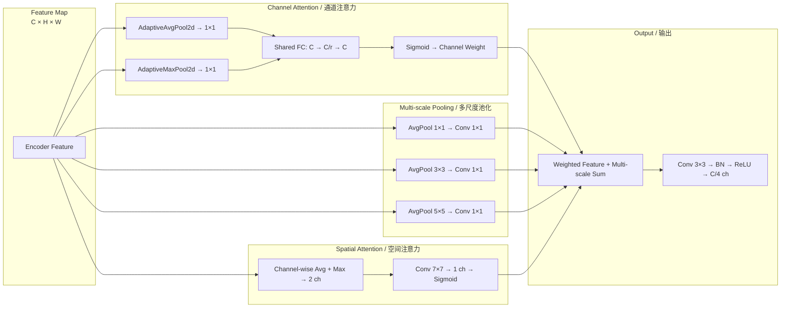
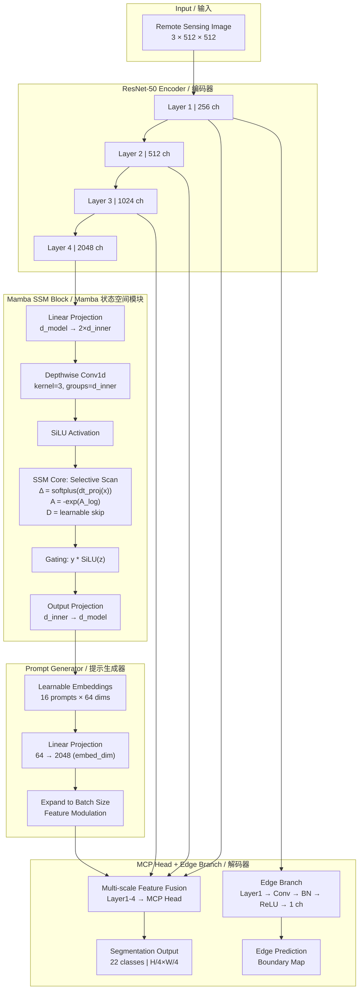
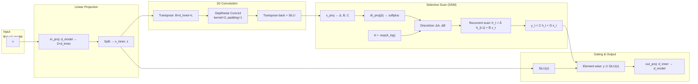
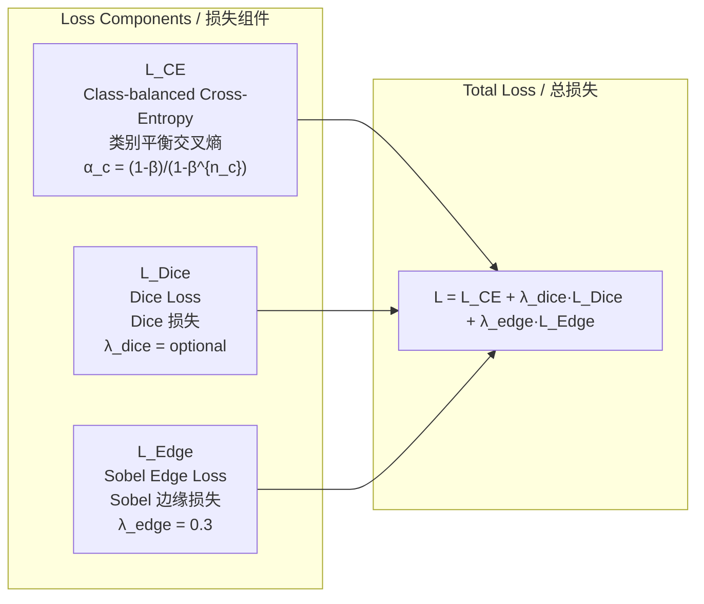
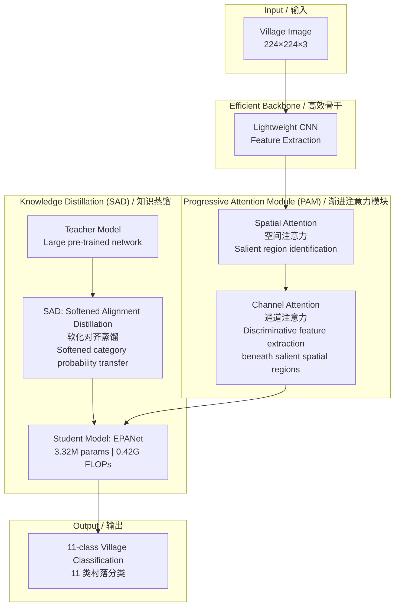
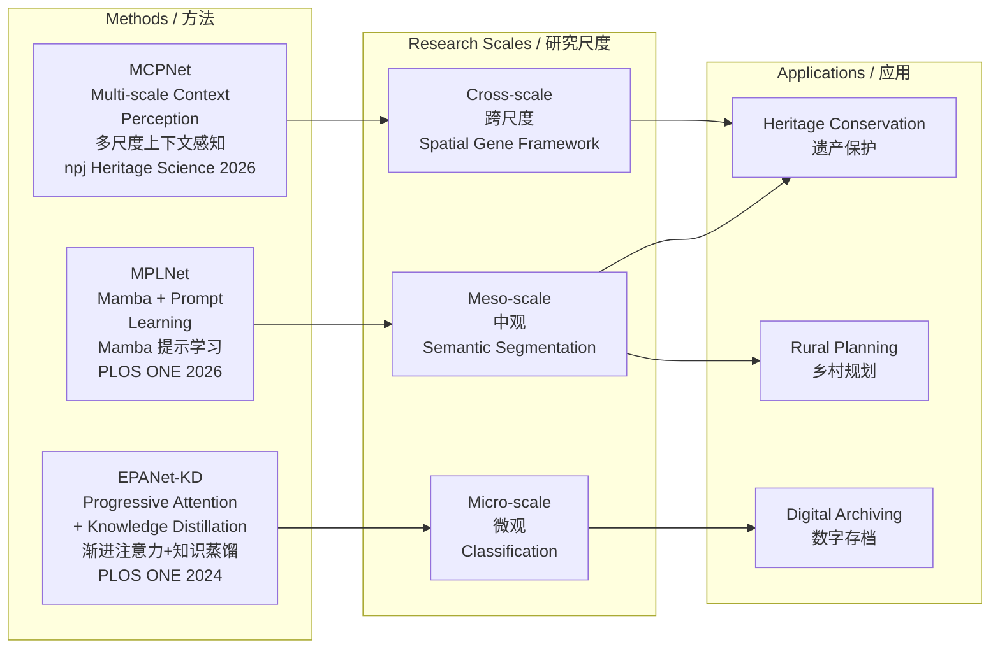

# Model Architecture Overview / 模型架构总览

> **Cheng Zhang, PhD / 张成博士**
>
> This document presents the complete architecture of MPLNet and MCPNet with Mermaid diagrams. All architectural details are verified from published papers and repository source code.

---

## 1. MCPNet: Multi-scale Context-Perceptual Network

**Paper:** Zhang et al., npj Heritage Science, 2026  
**DOI:** [10.1038/s40494-025-02253-1](https://doi.org/10.1038/s40494-025-02253-1)  
**Code:** `models/mcpnet.py`

### Architecture Diagram



### MCP Module Detail / MCP 模块详解



### Verified Performance Metrics

| Metric | MCPNet | DeepLabV3+ | Advantage |
|--------|--------|------------|-----------|
| mAcc (Official, 20 classes) | **34.7%** | 29.6% | **+5.1 pp** |
| mIoU (Official, 20 classes) | **24.3%** | 21.7% | **+2.6 pp** |
| BF@3px | **71.0%** | 66.0% | **+5.0 pp** |
| Acc (Operational, 22 classes) | **85.3%** | — | — |
| mIoU (Operational, 22 classes) | **70.7%** | — | — |

### Computational Cost

| Metric | Value |
|--------|-------|
| Parameters | **55.3M** |
| GFLOPs | **198.5** |
| Inference Speed | **16 FPS** (FP32, batch=1, RTX 4080) |
| Efficiency Ratio | **1.047×** (accuracy per FLOP vs. ABMDRNet) |

---

## 2. MPLNet: Mamba Prompt Learning Network

**Paper:** Zhang et al., PLOS ONE, 2026  
**DOI:** [10.1371/journal.pone.0341130](https://doi.org/10.1371/journal.pone.0341130)  
**Code:** `models/mplnet.py`

### Architecture Diagram



### Mamba SSM Block Detail / Mamba 模块详解



### Loss Function

MPLNet uses a combined objective tailored to long-tailed heritage class distributions:



---

## 3. EPANet-KD: Efficient Progressive Attention Network

**Paper:** Zhang et al., PLOS ONE, 2024  
**DOI:** [10.1371/journal.pone.0298452](https://doi.org/10.1371/journal.pone.0298452)

### Architecture Diagram



### EPANet-KD Efficiency / 效率指标

| Metric | Value |
|--------|-------|
| Parameters | **3.32M** |
| FLOPs | **0.42G** |
| Dataset | PVCD: 4,400 images, 11 Jiangxi region categories |
| Distillation | SAD (Softened Alignment Distillation) |

---

## 4. Method Comparison / 方法对比



---

## Citation

```bibtex
@article{zhang2026decoding,
  title={Decoding spatial genes of living heritage in traditional villages: TV-RSI-413 and MCPNet},
  author={Zhang, Cheng and Liu, P and Teng, J and et al.},
  journal={npj Heritage Science},
  volume={14},
  pages={89},
  year={2026},
  doi={10.1038/s40494-025-02253-1}
}

@article{zhang2026mplnet,
  title={MPLNet: Mamba prompt learning network for semantic segmentation of remote sensing images of traditional villages},
  author={Zhang, Cheng and Liu, P and Teng, J and et al.},
  journal={PLOS ONE},
  volume={21},
  number={2},
  pages={e0341130},
  year={2026},
  doi={10.1371/journal.pone.0341130}
}

@article{zhang2024epanet,
  title={EPANet-KD: Efficient progressive attention network for fine-grained provincial village classification via knowledge distillation},
  author={Zhang, Cheng and Liu, Chunqing and Gong, Huimin and Teng, Jinlin},
  journal={PLOS ONE},
  volume={19},
  number={2},
  pages={e0298452},
  year={2024},
  doi={10.1371/journal.pone.0298452}
}
```

---

*All architectural details verified from published papers and repository source code.*
*Last Updated: 2026-05-26*