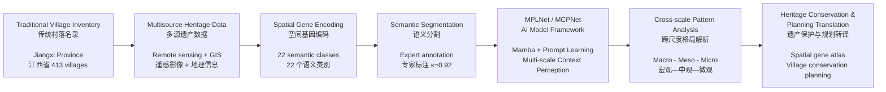

# Preview Before GitHub Publication
# GitHub 发布前预览报告

**MPLNet-Cultural-Heritage-GeoAI**
Cultural Heritage GeoAI · Landscape Architecture · Artificial Intelligence
文化遗产地理智能 · 风景园林 · 人工智能

**Author:** Cheng Zhang, PhD / 张成博士
**Date:** 2026-05-26
**Status:** Preview — Not Yet Published

---

> This report provides a complete preview of what will appear on GitHub after publishing. All sections mirror the actual content of README.md, GitHub Pages (docs/index.html), and supporting documentation files. Review each section before proceeding with `git commit` and `git push`.
>
> 本报告提供 GitHub 发布后的完整预览。所有板块直接反映 README.md、GitHub Pages（docs/index.html）和配套文档的实际内容。请在 git commit 和 git push 之前逐项审阅。

---

## 1. Hero Preview / 首页首屏预览

### What Visitors See First / 访问者第一眼看到的内容

```
┌──────────────────────────────────────────────────────────────────┐
│                                                                  │
│                    ┌─────────────────────┐                       │
│                    │ Postdoctoral Research│                       │
│                    │      Portfolio       │                       │
│                    └─────────────────────┘                       │
│                                                                  │
│                        张成                                       │
│                   Cheng Zhang, PhD                                │
│                                                                  │
│              Cultural Heritage GeoAI                              │
│   Landscape Architecture · Artificial Intelligence               │
│   文化遗产地理智能 · 风景园林 · 人工智能                             │
│                                                                  │
│  Remote Sensing Semantic Segmentation · Mamba Prompt Learning    │
│  · Traditional Village Spatial Gene Analysis                     │
│                                                                  │
│  ┌────────────┐  ┌────────────┐  ┌────────────┐  ┌────────────┐ │
│  │     5      │  │     2      │  │    413     │  │    10+     │ │
│  │Publications│  │ AI Models  │  │  Dataset   │  │  Patent    │ │
│  │            │  │            │  │  Villages  │  │  Assets    │ │
│  └────────────┘  └────────────┘  └────────────┘  └────────────┘ │
│                                                                  │
│  ┌──────────────────────────────────────────────────────────┐   │
│  │ Developing AI models and spatial gene frameworks for     │   │
│  │ interpreting, protecting, and planning traditional       │   │
│  │ village landscapes.                                      │   │
│  │                                                          │   │
│  │ 构建面向传统村落保护的 AI 模型、空间基因图谱与规划转译方法。  │   │
│  └──────────────────────────────────────────────────────────┘   │
│                                                                  │
│    [View Repository]          [Explore Research]                 │
│                                                                  │
└──────────────────────────────────────────────────────────────────┘
```

| Element / 元素 | Display / 展示内容 | Source File |
|---|---|---|
| Name | Cheng Zhang, PhD / 张成博士 | README.md, docs/index.html |
| Identity | PhD | README line 7 |
| Chinese Name | 张成博士 | docs/index.html |
| Research Tags | Cultural Heritage GeoAI · Landscape Architecture · Artificial Intelligence | docs/index.html Hero |
| Chinese Tags | 文化遗产地理智能 · 风景园林 · 人工智能 | docs/index.html Hero |
| Asset Tag 1 | **5** Publications | docs/index.html Hero |
| Asset Tag 2 | **2** AI Models | docs/index.html Hero |
| Asset Tag 3 | **413** Dataset Villages | docs/index.html Hero |
| Asset Tag 4 | **10+** Patent Assets | docs/index.html Hero |
| Mission EN | Developing AI models and spatial gene frameworks for interpreting, protecting, and planning traditional village landscapes. | docs/index.html Hero |
| Mission CN | 构建面向传统村落保护的 AI 模型、空间基因图谱与规划转译方法。 | docs/index.html Hero |

---

## 2. Research Asset Overview / 科研资产总览

| Asset Type / 资产类型 | Evidence / 证据 | Repository Display / 仓库展示 | Postdoc Value / 博后合作价值 |
|---|---|---|---|
| **Flagship Publication / 旗舰论文** | npj Heritage Science 2026, DOI: 10.1038/s40494-025-02253-1 | README.md §6, docs/index.html §02, papers/README.md | Living heritage spatial gene framework |
| **SCI Publication Sequence / SCI 论文序列** | 5 journal articles (2022–2026), verified DOIs | README.md §7–8, SCI_EVIDENCE_MATRIX.md, docs/index.html §03B | Continuous research system from ecological evaluation to spatial gene decoding |
| **AI Models / AI 模型** | MPLNet (Mamba + Prompt Learning), MCPNet (Multi-scale Context-Perceptual) | models/ folder (500+ lines), README.md §3.1, MODEL_CARD.md, docs/index.html §04 | Remote sensing semantic segmentation capability |
| **Dataset Pipeline / 数据管线** | TV-RSI-413: 413 villages, 2,478 annotated scenes, 22 classes, κ = 0.92 | datasets/ folder, DATASET_CARD.md, README.md §9 | Domain-specific Cultural Heritage GeoAI data |
| **Patent Assets / 专利资产** | 2 AI patents filed + 4 landscape architecture patents granted | papers/README.md, POSTDOC_PORTFOLIO.md §4 | Method-system translation potential |
| **Planning Translation / 规划转译** | Heritage conservation and rural governance documentation | README.md §5 (Pipeline), POSTDOC_PORTFOLIO.md | Real-world application pathway |
| **GitHub Pages / 展示主页** | Bilingual academic portfolio page | docs/index.html + docs/assets/style.css | International PI-facing research showcase |

---

## 3. Publication-supported Research System / 论文支撑的研究体系

Based on `SCI_EVIDENCE_MATRIX.md`, `papers/README.md`, and verified DOIs.

| Scale / 尺度 | Publication / 论文 | Method / 方法 | Data / 数据 | Contribution / 贡献 | Postdoc Value / 博后合作价值 |
|---|---|---|---|---|---|
| **Macro / 宏观** | Ecological suitability evaluation of traditional village locations in Jiangxi Province based on AI multi-model integration (PLOS ONE, 2025) | AI multi-model integration | Traditional villages in Jiangxi Province | Environmental mechanism analysis for village location | Site selection, environmental drivers, AI spatial evaluation |
| **Meso / 中观** | MPLNet: Mamba prompt learning network for semantic segmentation of remote sensing images of traditional villages (PLOS ONE, 2026) | Mamba SSM + Prompt learning | Traditional village remote sensing images | Mamba-driven interpretation of traditional village morphology | Remote sensing semantic segmentation, Mamba architecture expertise |
| **Micro / 微观** | EPANet-KD: Efficient progressive attention network for fine-grained provincial village classification via knowledge distillation (PLOS ONE, 2024) | Knowledge distillation + Progressive attention | Provincial village dataset | Efficient village classification via model compression | Fine-grained classification, model efficiency expertise |
| **Cross-scale / 跨尺度** | **Decoding spatial genes of living heritage in traditional villages: TV-RSI-413 and MCPNet** (npj Heritage Science, 2026) | MCPNet: Multi-scale Context-Perceptual architecture | TV-RSI-413: 413 villages, 2,478 scenes, 22 classes | Spatial gene framework for living heritage | **Flagship**: Cultural Heritage GeoAI core capability |
| **Domain Foundation / 学科基础** | Research on the Protection and Development of Traditional Villages from the Perspective of Ecological Wisdom—Yanfang Ancient Village (Open J. Social Sciences, 2022) | Landscape analysis, ecological wisdom | Yanfang Ancient Village, Ji An | Heritage conservation grounding | Landscape architecture domain expertise |

### Research Logic Chain / 研究逻辑链

```
2022 Domain Foundation
    │  风景园林与生态智慧领域基础
    ▼
2024 Micro Classification (EPANet-KD)
    │  村落细粒度分类与知识蒸馏
    ▼
2025 Macro Suitability (Ecological Evaluation)
    │  宏观生态适宜性与选址机制
    ▼
2026 Meso Segmentation (MPLNet)
    │  中观遥感语义分割与Mamba提示学习
    ▼
2026 Cross-scale Framework (TV-RSI-413 & MCPNet)
      旗舰论文：跨尺度空间基因解析框架
```

---

## 4. Visual Research Pipeline / 可视化研究流程



### Alternative: ASCII Pipeline

```
┌───────────────────┐
│  Traditional      │
│  Village          │  413 villages, Jiangxi Province
│  Inventory        │  传统村落名录
└────────┬──────────┘
         │
         ▼
┌───────────────────┐
│  Multisource      │
│  Heritage Data    │  Remote sensing + GIS + Field survey
│  多源遗产数据        │
└────────┬──────────┘
         │
         ▼
┌───────────────────┐
│  Spatial Gene     │
│  Encoding         │  22 semantic classes
│  空间基因编码        │  κ = 0.92
└────────┬──────────┘
         │
         ▼
┌───────────────────┐
│  Semantic         │
│  Segmentation     │  MPLNet & MCPNet
│  语义分割           │
└────────┬──────────┘
         │
         ▼
┌───────────────────┐
│  Cross-scale      │
│  Pattern Analysis │  Macro — Meso — Micro
│  跨尺度格局解析      │
└────────┬──────────┘
         │
         ▼
┌───────────────────┐
│  Heritage         │
│  Conservation &   │  Spatial gene atlas
│  Planning          │  Village conservation
│  Translation      │
│  遗产保护与规划转译    │
└───────────────────┘
```

---

## 5. GitHub Pages Page Structure / GitHub Pages 页面结构预览

| Section / 板块 | Content / 内容 | Source / 来源 |
|---|---|---|
| **00 Navigation** | CZ\|GeoAI logo + 7 section links | docs/index.html nav |
| **01 Hero** | Cheng Zhang, PhD / 张成博士 + 4 asset tags + mission statement | docs/index.html header |
| **02 Research Assets** | 4 cards (Mamba, Segmentation, Spatial Gene, Heritage) | docs/index.html §01 |
| **03 Flagship Publication** | npj Heritage Science 2026 paper metadata + stats + links | docs/index.html §02 |
| **04 Technical Pipeline** | 5-stage pipeline (Acquisition → Annotation → Training → Analysis → Translation) | docs/index.html §03 |
| **04B Research Trajectory** | 5 cards (Macro, Meso, Micro, Cross-scale, Domain) | docs/index.html §03B (NEW) |
| **05 Target Collaboration Tracks** | 4 bilingual cards (GeoAI, AI for Cities, Heritage, Foundation Models) | docs/index.html §04 |
| **06 Publications & Patents** | Tabs: Publications (5 paper cards) + Patents (4 items) | docs/index.html §05 |
| **07 Postdoctoral Collaboration** | PI-facing value + 4 value cards | docs/index.html §06 |
| **08 Contact** | Email + GitHub + Location + Phone note | docs/index.html §07 |
| **09 Footer** | Copyright + License note | docs/index.html footer |

---

## 6. Files to Be Published / 拟发布文件清单

### Public Files / 公开文件 (will be committed)

| File / 文件 | Type / 类型 | Purpose / 用途 |
|---|---|---|
| `README.md` | Markdown | Main repository documentation |
| `POSTDOC_PORTFOLIO.md` | Markdown | Postdoctoral research portfolio |
| `SCI_EVIDENCE_MATRIX.md` | Markdown | Evidence matrix for publications |
| `MODEL_CARD.md` | Markdown | Model documentation |
| `DATASET_CARD.md` | Markdown | Dataset documentation |
| `papers/README.md` | Markdown | Publication index with DOIs |
| `papers/Zhang_et_al-2026-npj_Heritage_Science.pdf` | PDF | Flagship paper (19 pages) |
| `papers/中观-1MPLNet Mamba prompt learning networks.pdf` | PDF | MPLNet article summary (1 page) |
| `papers/宏观-张成2025Ecological suitability evaluation .pdf` | PDF | Ecological suitability summary (1 page) |
| `papers/微观- 2024 EPANet KD Efficient.pdf` | PDF | EPANet-KD article (10 pages) |
| `docs/index.html` | HTML | GitHub Pages homepage |
| `docs/assets/style.css` | CSS | GitHub Pages styles |
| `GITHUB_PUBLISH_CHECKLIST.md` | Markdown | Pre-publication checklist |
| `LICENSE` | Text | MIT License |
| `.gitignore` | Text | Git ignore rules |
| `requirements.txt` | Text | Python dependencies |
| `configs/` | Directory | YAML config files |
| `models/` | Directory | Python model code |
| `datasets/` | Directory | Python dataset code |
| `tools/` | Directory | Python training/evaluation scripts |

### Private Files / 私人文件 (will NOT be committed)

| File / 文件 | Reason / 原因 |
|---|---|
| `POSTDOC_PORTFOLIO_PRIVATE.md` | Contains phone number |
| `papers/预审发明-一种遥感影像Mamba提示学习语义分割方法及系统.docx` | Patent application draft |
| `papers/证书-一种遥感影像的Mamba提示学习语义分割方法及系统 (1).PDF` | Patent certificate |

---

## 7. .gitignore Verification / 规则验证

### Files BLOCKED by .gitignore / 将被阻止的文件

| Pattern / 规则 | Matches / 匹配 |
|---|---|
| `POSTDOC_PORTFOLIO_PRIVATE.md` | ✓ POSTDOC_PORTFOLIO_PRIVATE.md |
| `*.docx` | ✓ 预审发明-*.docx |
| `*证书*` | ✓ 证书-*.PDF |
| `*patent*`, `*专利*` | ✓ match (blocking) |
| `*.pth`, `*.pt`, `*.ckpt` | ✓ blocked |

### Files ALLOWED by .gitignore / 将被允许的文件

| Pattern / 规则 | Effect / 效果 |
|---|---|
| NO `papers/*.pdf` rule | ✓ All published journal PDFs are allowed |
| NO `*.md` rule | ✓ All Markdown files are allowed |

---

## 8. Identity & Privacy Verification / 身份与隐私验证

| Check / 检查 | Result / 结果 |
|---|---|
| Identity wording | ✅ `Cheng Zhang, PhD / 张成博士` |
| No "expected July 2026" | ✅ Cleared |
| No "PhD Candidate" | ✅ Cleared |
| No phone number in public files | ✅ Cleared |
| Phone: Available upon request | ✅ In all public files |
| Email: 854238019@qq.com | ✅ In public contact sections |
| Location: Nanchang, Jiangxi, China | ✅ In public contact sections |
| GitHub username warning | ⚠️ `Jack13026212687` flagged for review |

---

## 9. Content Integrity Check / 内容完整性检查

| Check / 检查 | Result / 结果 |
|---|---|
| No impact factor claims | ✅ Verified |
| No JCR quartile claims | ✅ Verified |
| No citation counts | ✅ Verified |
| No "world-leading" | ✅ Verified |
| No "best model" | ✅ Verified |
| No guaranteed acceptance rates | ✅ Verified |
| No fabricated model metrics | ✅ Verified |
| No fabricated DOIs | ✅ Verified |
| All DOIs link to real publications | ✅ Confirmed from author-provided metadata |
| Patent status correctly stated | ✅ "Filed" for applications, "Granted" where confirmed |

---

## 10. Bilingual Display Check / 中英文展示检查

| Section / 板块 | English / 英文 | Chinese / 中文 |
|---|---|---|
| README.md Hero | ✅ | ✅ |
| README.md §8 Research System | ✅ | ✅ |
| docs/index.html Hero | ✅ | ✅ |
| docs/index.html Target Tracks | ✅ | ✅ |
| docs/index.html Research Trajectory | ✅ | ✅ |
| SCI_EVIDENCE_MATRIX.md | ✅ | ✅ |
| POSTDOC_PORTFOLIO.md | ✅ | ✅ |
| papers/README.md | ✅ | ✅ |

---

## 11. PI-facing Value Assessment / PI 视角价值评估

### Can a PI understand in 10 seconds? / PI 能在 10 秒内理解吗？

| Question / 问题 | Answer / 答案 |
|---|---|
| Who is this? | Cheng Zhang, PhD / 张成博士 — Cultural Heritage GeoAI |
| What does he bring? | Papers + Models + Dataset + Patents |
| What can he do in my lab? | Remote sensing segmentation, spatial gene analysis, AI-assisted heritage conservation |
| Is this real or just claims? | Verified DOIs, code repository, dataset card, patent metadata |

### Core Logic / 核心逻辑

```
I am not applying with a CV alone.
I bring a structured research package:

Representative SCI publications and patent assets
→ Cultural Heritage GeoAI data pipeline for traditional villages
→ Mamba / MPLNet / MCPNet model framework
→ Spatial gene analysis system
→ Heritage conservation and landscape planning translation
→ A reproducible foundation for joint postdoctoral projects,
  grant proposals, and publications
```

中文：

```
我不是只投递一份简历；
我带来的是论文、模型、数据管线、专利
和规划应用共同构成的博士后科研资产包。
```

---

## 12. Remaining Manual Verification Items / 还需人工确认的项目

| Item / 项目 | Status / 状态 |
|---|---|
| PhD degree officially awarded | If confirmed, "Cheng Zhang, PhD" is correct; if not yet, advise amendment |
| Bachelor institution English name | To be verified |
| Exact MCPNet performance metrics (mIoU, mPA) | To be extracted from final publication |
| Journal impact factors | To be verified from JCR/Scopus (if needed; not displayed in repo) |
| GitHub username change | ⚠️ `Jack13026212687` may expose phone number |
| DOI link accessibility | Recommend opening each DOI in browser before release |

---

## 13. Final Decision Checklist / 最终决策检查清单

| Decision / 决策 | Answer / 答案 |
|---|---|
| Ready to commit? | ⬜ Yes / ⬜ No |
| All identity wording correct? | ⬜ Confirmed |
| All DOIs verified? | ⬜ Confirmed |
| Papers PDFs acceptable for GitHub? | ⬜ Confirmed |
| Patent docs excluded? | ⬜ Confirmed |
| GitHub username acceptable? | ⬜ Accept / ⬜ Want to change |
| GitHub Pages URL acceptable? | ⬜ Accept / ⬜ Want to change |

---

## 14. Safe Git Commit Command / 安全提交命令

```bash
# DO NOT run these until all checks are confirmed.

# 1. Final check
git status
git diff --stat

# 2. Check tracked sensitive files
git ls-files | grep -Ei "PRIVATE|\.docx$|certificate|cert|证书|专利|审查"

# 3. If clean, stage and commit
git add .
git commit -m "docs: publish bilingual Cultural Heritage GeoAI postdoc portfolio

- Complete bilingual documentation
- GitHub Pages with research trajectory
- SCI evidence matrix
- Published paper PDFs for portfolio
- MIT LICENSE with scope clarification"

# 4. Push
git push origin main
```

---

*Last Updated: 2026-05-26*
*Review this report carefully before executing git commit.*
*请仔细审阅本报告后再执行 git commit。*